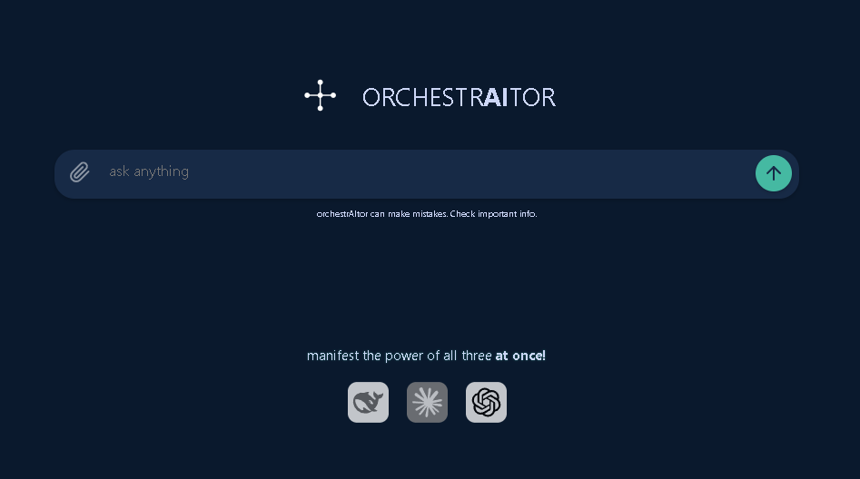

# orchestrAItor

[](https://react.dev/)
[](https://opensource.org/licenses/MIT)

A sophisticated AI orchestration chat interface that combines multiple AI capabilities in one seamless experience.



## Features

- **Multi-AI Integration**: Visual indicators for DeepSeek (blue), Claude (red), and OpenAI (white) models
- **Dynamic Chat Interface**:
  - Auto-expanding text input with shift+enter support
  - Smooth message transitions and scroll management
  - Scroll-to-bottom indicator for new messages
- **Code Collaboration**:
  - Syntax-formatted code blocks with copy functionality
  - Visual feedback on copy success
- **Animated Visuals**:
  - Pulsing central logo during AI processing
  - Animated model indicators with color-coded glows
  - Interactive SVG graphics with hover effects
- **Responsive Design**:
  - Collapsible sidebar with smooth transitions
  - Adaptive message containers for different screen sizes
  - Mobile-friendly layout

## Installation

1. Clone repository:
   ```bash
   git clone https://github.com/yourusername/orchestrAItor.git
   ```
2. Install dependencies:
   ```bash
   npm install
   ```
3. Start development server:
   ```bash
   npm start
   ```

## Usage

- **New Chat**: Click the "+ New Chat" button in the sidebar
- **Input Message**:
  - Type your message in the bottom textarea
  - Use Shift+Enter for new lines, Enter to send
- **Code Blocks**:
  - Automatic detection of triple backtick code blocks
  - Click "Copy" to copy code snippets
- **Model Interaction**:
  - View active model through glowing logo indicators
  - Toggle between models using the logo buttons

## Component Structure

```
src/
├── App.js               # Main application component
├── App.css              # Global styles
├── icon.svg             # Main application icon
├── deepseek.svg         # DeepSeek logo
├── claude.svg           # Claude logo
└── openai.svg           # OpenAI logo
```

## Key Technologies

- **React Hooks**: `useState`, `useRef`, `useEffect` for state management
- **CSS Custom Properties**: Dynamic color variables for model indicators
- **SVG Animations**: Custom keyframe animations for logo elements
- **Clipboard API**: Secure text copying functionality
- **Flexbox/Grid**: Modern layout techniques for responsiveness

## Configuration

Create a `.env` file for future API integrations:

```
REACT_APP_DEEPSEEK_KEY=your_key_here
REACT_APP_CLAUDE_KEY=your_key_here
REACT_APP_OPENAI_KEY=your_key_here
```
